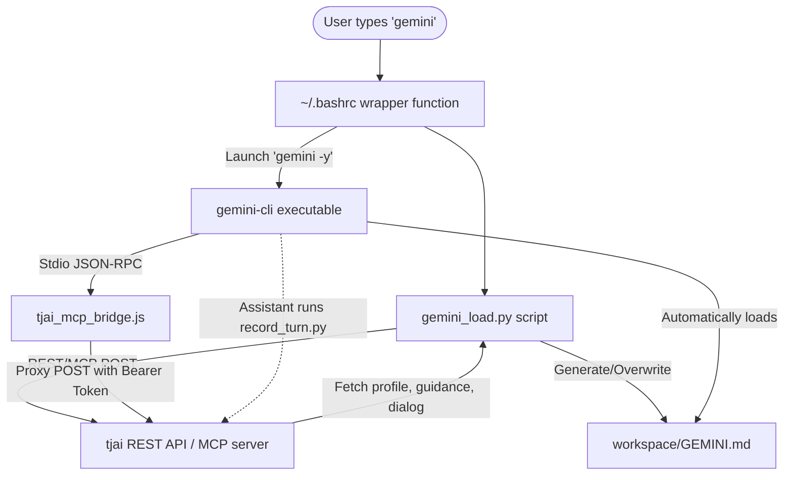

# Antigravity (Gemini) CLI Integration Walkthrough

This document records the integration of the **Antigravity (Gemini) CLI** into Torre's multi-CLI mix and describes how it is configured to match his **Claude Code** and **Codex** environments.

To honor our setup standard, all durable configuration, pre-launch hooks, and bridge scripts are **tracked under version control** inside `tjrepo` (`/Users/wenaus/github/tjrepo/computers/common/gemini-hooks/`), serving as the single source of truth across machines.

The integration delivers an automated, auto-approved setup that supports:
1. **Auto-approvals for passive info gathering**
2. **Auto-accept (YOLO) mode enabled by default**
3. **Dynamic startup context loading (recent dialog, profile, and guidance)**
4. **Availability of the `tjai` MCP server and tools**
5. **Self-logging of conversational turns back to `tjai`**

---

## 🛠️ Architecture & Implemented Components



### 1. Settings & Permissions (`settings.json`)
The settings file `/Users/wenaus/.gemini/antigravity-cli/settings.json` has been updated to grant auto-approval to the following passive information-gathering commands:
* `ls`, `cat`, `grep`, `rg`, `find`, `wc`, `file`, `stat`, `du`, `df`
* `which`, `hostname`, `whoami`, `ps`, `env`, `printenv`, `git`, `jq`, `head`, `tail`, `echo`, `date`

### 2. Startup Context & Dialog Loader (`gemini_load.py`)
Since the Gemini CLI does not support session-start shell hooks like Claude, we created a lightweight pre-launch wrapper script:
* **Tracked File Path**: `tjrepo/computers/common/gemini-hooks/gemini_load.py`
* **Function**: 
  1. Fetches the `tjai` user profile and host-specific AI guidance (e.g., `location_name="StudioMax"`, `context="tjai"`) directly from the `tjai` API.
  2. Fetches the 20 most recent dialog turns from prior sessions.
  3. Overrides the date context using America/New_York (authoritative ET timezone).
  4. Injects core `SYSPROMPT.md` additions.
  5. Generates or overwrites the `/Users/wenaus/github/GEMINI.md` workspace file before launching the CLI.
* **Why this works**: The Gemini CLI automatically reads `GEMINI.md` from the workspace root on startup and appends it to hierarchical system instructions. This ensures the model boots up with full context and memories instantly.

### 3. Launch Function (`~/.bashrc`)
A `gemini()` wrapper function is registered directly below the `codex()` function in the tracked `~/.bashrc` file (`tjrepo/computers/laptop/config-files/.bashrc`):
```bash
gemini() {
    python3 ~/github/tjrepo/computers/common/gemini-hooks/gemini_load.py >/dev/null 2>&1 || true
    command gemini -y "$@"
}
```
* **Why this is critical**: 
  * It silently runs the context loader (`gemini_load.py`) to build the fresh `GEMINI.md` context before launching.
  * It passes `-y` (YOLO / Auto-accept mode) automatically, completely solving the constant prompt approval issue in-session.

### 4. `tjai` MCP Server Stdio Bridge (`tjai_mcp_bridge.js`)
We registered your `tjai` HTTP MCP server in `settings.json`. Since the Gemini CLI does not support custom header injection (like Claude's `"headers": {"Authorization": "Bearer ${TJAI_MCP_TOKEN}"}`), we built a high-performance Stdio-to-POST bridge:
* **Tracked File Path**: `tjrepo/computers/common/gemini-hooks/tjai_mcp_bridge.js`
* **Registered in Settings**:
  ```json
  "mcpServers": {
    "tjai": {
      "command": "/Users/wenaus/github/tjrepo/computers/common/gemini-hooks/tjai_mcp_bridge.js",
      "env": {
        "TJAI_MCP_TOKEN": "REDACTED_MCP_TOKEN"
      }
    }
  }
  ```
* **Function**: Communicates over `stdio` with the Gemini CLI, translates all outgoing JSON-RPC requests, and sends them via local Node `fetch` POST requests directly to `https://etaverse.com/tjai/mcp/` with your Bearer Token, returning results instantly back to stdout.

### 5. In-Session Conversational Turn Self-Logging (`record_turn.py`)
To ensure that conversational turns in Gemini sessions are saved back to the `tjai` dialog store:
* **Tracked File Path**: `tjrepo/computers/common/gemini-hooks/record_turn.py`
* **Behavior**: At the end of every user turn, the generated `GEMINI.md` directs the assistant to run:
  `python3 /Users/wenaus/github/tjrepo/computers/common/gemini-hooks/record_turn.py "<user_prompt>" "<assistant_response>"`
* **YOLO Advantage**: Because the CLI runs in YOLO mode by default, this self-logging command executes instantly and silently in the background, keeping cross-session memory perfectly synchronized.
