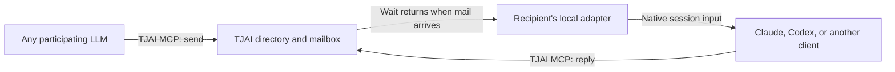

# Distributed LLM communications plan

Date: 2026-09-12

Status: proposed architecture accepted for planning; implementation has not begun.
The first implementation step is a bounded feasibility check of delivery into
the existing interactive clients, especially Codex.

## Objective

Enable independent LLM sessions, across machines and providers, to discover one
another and coordinate ongoing work through short, promptly delivered messages.
The motivating use case is several sessions working on the same SWF monitor and
coordinating changes and deployments without the operator relaying messages.

Claude Code already provides this experience among Claude sessions. Adding Codex
or another client currently leaves that participant outside the conversation.
The objective is to extend the experience across clients while retaining native
delivery where available.

Use TJAI as the shared session directory and durable mailbox. Expose common
messaging tools through TJAI MCP, and use a small local adapter to deliver
messages into each recipient's actual running session. The client running the
model determines its delivery capabilities; model family alone does not.

## Findings and current boundaries

### Claude Code

Claude Code provides `ListAgents` for discovery and `SendMessage` for peer
messages. During an active turn, messages arrive between tool calls; when idle,
the receiving session starts a turn. Local delivery uses per-session sockets;
cross-machine delivery uses Remote Control. Anthropic documents the inbox socket
for scripts and hooks posting into a session, including exported socket and
authentication-token variables.

The shared launcher already assigns readable session names, and shared settings
recognize communication among the operator's sessions as routine. This existing
inbox is the first integration route to investigate. Verify message format,
inbound controls and receipt behavior against the installed client.

Claude also exposes an MCP Channels interface for external events. Custom
channels require a development opt-in under the documented research preview.
It is an alternative delivery adapter if the existing inbox is unsuitable.

References:

- [Cross-session messaging](https://code.claude.com/docs/en/cross-session-messaging)
- [Channels reference](https://code.claude.com/docs/en/channels-reference)
- [Shared session launcher](../../computers/common/claude-launch.sh)
- [Shared Claude settings](../../computers/common/claude-settings.json)

### TJAI

TJAI has authenticated tools and authoritative PostgreSQL storage, but no live
session directory or message-delivery service. Its MCP service deliberately uses
stateless, finite JSON request/response calls. Adding a sending tool alone would
store messages without making a recipient aware of them.

The proposed waiting mechanism can remain a finite request and preserve this
transport policy. PostgreSQL notifications already provide a wake mechanism
elsewhere in TJAI; durable message rows would remain authoritative.

References:

- [MCP transport and deployment](mcp.md)
- [MCP implementation](../tjai_app/mcp.py)
- [ASGI transport boundary](../tjai_project/mcp_asgi.py)
- [Wrangler PostgreSQL wake mechanism](wrangler.md)

### Codex

The documented app-server interface supports `turn/steer` for input during an
active turn and `turn/start` for starting an idle turn. The adapter must connect
to the app-server that owns the interactive session. Reopening a saved
transcript in a different process would not deliver into that live execution.

The inspection on 2026-09-12 found Codex CLI 0.154.0 and no managed app-server
control socket at the default local location on ec2dev. This does not establish
that every possible integration is unavailable. It identifies the main
feasibility question: how the operator's actual interactive clients expose their
owning runtime, and whether launcher changes are needed. Do not assume current
sessions are externally steerable merely because the API exists.

Reference: [Codex app-server](https://developers.openai.com/codex/app-server).

## Architecture

For shared work, participants use the TJAI directory and sending tools. A
Claude-only conversation about deployment could otherwise continue to exclude
Codex even after Codex acquires an inbox. Claude's native inbox can remain the
recipient-side delivery mechanism.

### Common tools and session identity

Keep the model-facing interface small. Proposed tool names are illustrative,
not implemented contracts.

| Tool | Purpose |
|------|---------|
| `list_sessions` | Find participants by name, machine, project or shared resource. |
| `send_message` | Send to a session or resource group, optionally requesting a reply. |
| `get_messages` | Recover pending messages and explicitly acknowledge receipt when needed. |

The adapter handles registration, connection health and delivery automatically.
Each session has a stable ID, a readable name such as `swf-testbed-2`, its
client/model, working directory and relevant resource groups. Names aid discovery;
stable IDs identify the intended session.

A group such as `swf-monitor` lets a newly started Codex session discover the
participants working on that monitor without knowing their names in advance.
The directory must distinguish connected participants from stale registrations.

### Waiting and transport

A small background adapter holds an outbound request to TJAI. The request
returns when messages arrive or after a bounded timeout, then the adapter waits
again. Waiting consumes no model calls. A finite MCP receive/wait operation can
serve this purpose without introducing an unsolicited server stream into the
existing TJAI MCP transport.

Store the message before waking waiting adapters. PostgreSQL notifications can
wake them promptly, while stored rows preserve messages across disconnections
and missed wake notifications. The adapter resumes delivery from durable pending
state after reconnecting.

Start with a bridge per session. A separate messaging platform, host-wide relay,
or LLM dispatcher is unnecessary for the initial scope. Background waiting and
delivery are ordinary software operations.

Subsecond transport delivery is a target to measure, not an established result.
The time at which the recipient considers a message depends on its client and
current tool execution. Delivery must respect the recipient's execution boundary.

### Client adapters

| Client | Proposed delivery | Remaining boundary |
|--------|-------------------|--------------------|
| Claude Code | Bridge into the existing inbox socket. | Verify the installed protocol, inbound controls and receipt behavior. |
| Codex | Connect to the owning app-server; steer an active turn or start an idle turn. | Establish access to the runtime used by the actual interactive client. |
| Other programmable clients | Insert messages into their conversation loop and wake an idle loop. | Implement the client-specific input adapter. |
| Clients exposing only ordinary MCP tools | Retrieve mail when they next invoke a tool. | Immediate unsolicited delivery requires additional client support. |

The common tools remain usable without a push-capable client, but the directory
should expose the actual delivery capability. Do not promise equal wake behavior
across clients that do not expose equivalent interfaces.

## Message behavior and record

- Distinguish a message stored by TJAI, a message handed to a client, and a message
  acknowledged by the model. Successful sending is not agreement or clearance.
- Assign message IDs, retain pending delivery across reconnects, and make
  acknowledgments idempotent. Retries must not create duplicate effects.
- Prefer short messages and explicit reply requests. Batch updates when useful;
  avoid automatic acknowledgments that trigger reciprocal message loops.
- Preserve sender, recipient, timestamps and reply relationships in TJAI. Make
  them available to dialog and assessment views as peer communication.
- Keep peer messages distinguishable from the operator's instructions and
  approval. Delivery must not confer authority to approve actions on the
  operator's behalf.
- Preserve provenance when projecting a stored message into session dialog so
  its send and receive records do not become unrelated or duplicated evidence.

## Deployment coordination

The communication layer should support exchanges such as:

> Preparing to deploy the monitor. Is your change ready?
>
> Wait; editing the shared template.
>
> Ready; include this revision.
>
> Deploy completed.

Messages alone cannot prevent two sessions from deciding to deploy at once.
After communication works, add a small atomic reservation for a named deployment
resource, enforced by the deployment script. An expiring reservation also needs
protection against a stale holder continuing after its reservation expires.

Readiness of the deployed files is separate from mutual exclusion. A deployment
lock cannot make a half-edited shared tree safe. Participants still need to agree
which changes or revision are ready to include. Silence must not count as
clearance.

This is a later extension of the messaging capability, not a prerequisite for
the initial client-delivery proof or a proposal for a general orchestration
framework.

## Implementation sequence and acceptance

1. Establish how to reach the owning runtime of an actual Codex interactive
   session. Determine whether the existing workflow can support the adapter and
   document any necessary launcher change before building the broader service.
2. Conduct a bounded delivery feasibility exercise with one Claude session and
   one Codex session: messages in both directions while active and idle, plus
   recovery of a queued message after reconnecting. Use explicitly designated
   sessions rather than injecting probes into unrelated ongoing work.
3. Add the minimal TJAI directory and durable mailbox, common tools and adapter
   lifecycle integration. Verify that receipt states and reconnect handling
   correspond to observed behavior.
4. Extend the same pair across machines and verify discovery, routing, reply
   provenance and delivery latency through TJAI.
5. Add deployment reservations only after the communication path works. Verify
   enforcement in the real deployment entry point and preserve separate
   readiness coordination.

For the delivery proof, report what reached the client, what the model
acknowledged, whether active and idle behavior both worked, and how reconnect
recovery behaved. A successful API response or a message appearing only in a
saved transcript is insufficient evidence of delivery into the live session.

The first unresolved decision is the Codex integration route. Remaining API
shapes and storage details should follow that proof rather than presuppose a
capability the interactive client may not expose.
